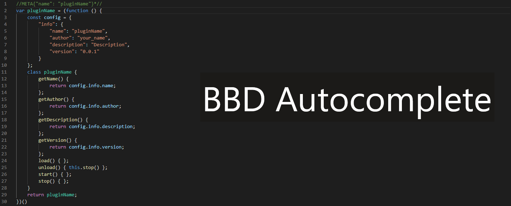
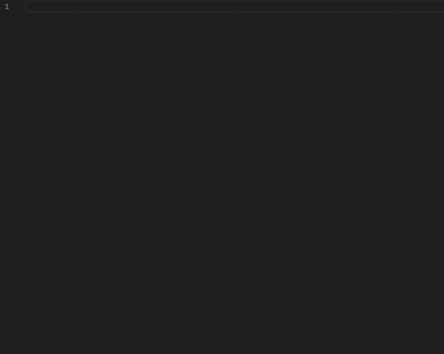

# BBD Autocomplete 

This is the [BetterDiscord](https://github.com/rauenzi/BetterDiscordApp) Autocomplete extension for Visual Studio Code, it helps you develop themes and plugins.

## Features

 > Build META's for themes and plugins.

 > ZLibrary plugin template.

-----

## Coming Soon

 > ZeresPluginLibrary Require autocomplete
 > & BdApi features.

## Release Notes

### [1.0.1]

Added [ZLibrary](https://github.com/rauenzi/BDPluginLibrary) plugin snippet.

### [1.0.0]

Initial release of BBD autocomplete.

-----

### For more information

* [Report Bugs | issues](https://github.com/Strencher/vsc-BBD-autocomplete/issues/new)
* [BetterDiscord Developer Docs](https://github.com/rauenzi/BetterDiscordApp/wiki)

### Contributors

* [RazerMoon](https://github.com/RazerMoon) - ZLibrary Snippet, Gifs and README changes.
